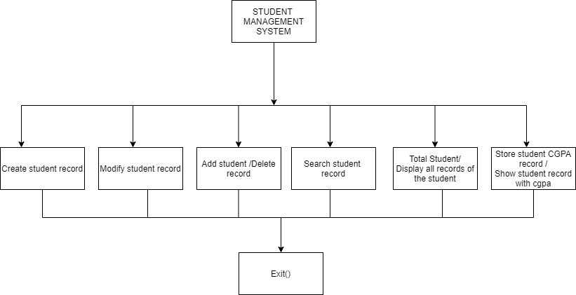

# Student_management
This is also a university project from Yangzhou university .Basically it's a project using c language . It's kind of primary level project to understand about programming.
 

 
  <!-- 
   
    
     
      
        -->
